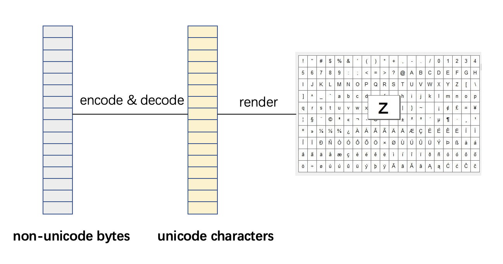
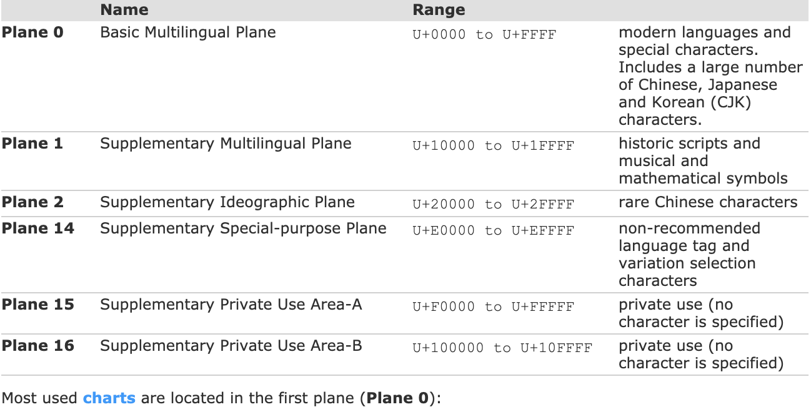
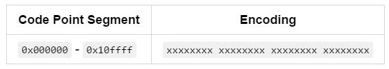
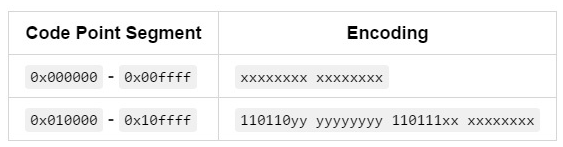
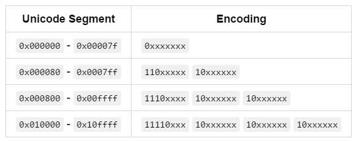
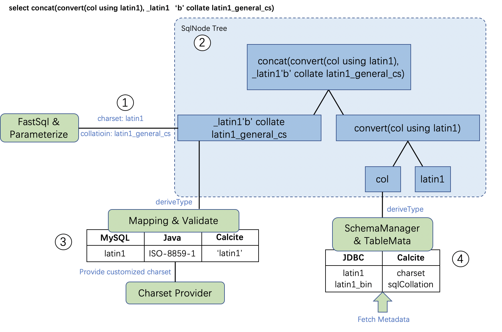
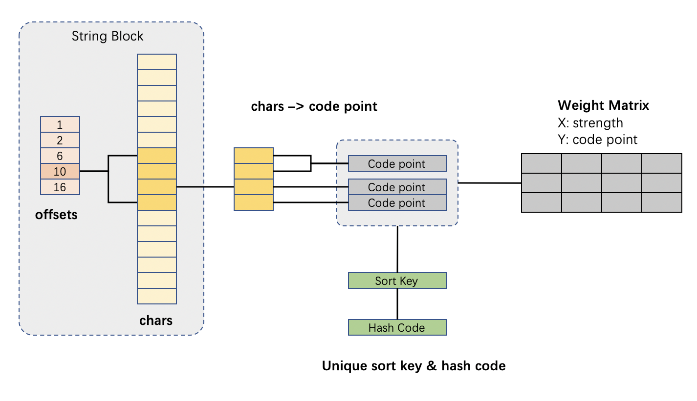

# PolarDB-X Charset & Collation设计方案

## 设计目标
MySQL中的字符类型包括varchar、char、text等，都具有charset和collation属性。其中charset代表着字符的编码方式，collation代表字符的比较规则。在执行层面，charset和collation会影响到比较、排序、哈希、函数求值的行为。PolarDB-X中目前没有很好的适配MySQL的charset和collation机制，导致的问题有：

1. 排序的结果可能与MySQL排序的结果不一致；
1. 比较运算结果和MySQL不一致；
1. Hash运算，如Hash Join，会出现漏匹配或误匹配的问题；
1. Agg运算，没有正确识别相同或者不同的字符串，导致结果错误；
1. 函数求值结果错误；
1. 不利于国际化
1. 其他使用到字符串比较、排序与哈希的地方

本项目将在PolarDB-X中引入Charset和Collation机制，期望修复上述问题，同时提升对MySQL的兼容性。

### 已支持
PolarDB-X上已经支持的与Charset与Collation相关的语句或功能，包括：

- 建库时，指定charset 与 collation，下发至物理库。
- 建表时，表结构中携带Charset & Collation信息：

CREATE TABLE tbl_name (column_list)<br /> [[DEFAULT] CHARACTER SET charset_name]<br /> [COLLATE collation_name]]

- 建表时，列定义中携带Charset & Collation信息：

col_name {CHAR | VARCHAR | TEXT} (col_length)<br /> [CHARACTER SET charset_name]<br /> [COLLATE collation_name]

- Alter Charst & Collation信息：

ALTER TABLE tbl_name<br /> [[DEFAULT] CHARACTER SET charset_name]<br /> [COLLATE collation_name]

- set names [charset] collate [collation]，同时修改以下三类系统变量：
         1. character_set_client & collation_client：数据库假定客户端传来数据的字符集和collation类型
         1. character_set_connection & collation_connection: 数据库将会把客户端数据转换为此类charset和collation
         1. character_set_result & collation_result：数据库返回给用户的数据中，使用的charset和collation.

如果有用户设置set names，则每次物理连接执行SQL时，都会对物理连接执行一次set names。<br />注：由于PolarDB-X与物理库之间使用了连接池，复杂的set names设置不能保证客户端-PolarDBX和PolarDBX-物理库这两组连接之间Charset和collation一致。因此set names限制为utf8mb4.

- show collation & show character set语句显示支持的collation和charset。这里使用的是硬编码，并非实际支持的charset & collation信息。

### 将要支持

- [ ] 将要支持的collation和charset类型建于附表
- [ ] 基于collation的Sort运算
  - [ ] MemSorter
  - [ ] ExternalSorter
- [ ] 基于collation的比较运算
  - [ ] Eq (=)
  - [ ] Gt (>)
  - [ ] Ge(>=)
  - [ ] Lt(<)
  - [ ] Le(<=)
  - [ ] Null-Safe Equal(<=>)
- [ ] 基于collation的Hash运算
  - [ ] StringBlock.hashCode
- [ ] 修复Agg运算结果中，不能忽略尾部空格的问题
- [ ] 修复依赖collation和charset的函数
  - [ ] hex(str) 
  - [ ] concat(str, str) 不同charset和collation属性的字符串混合
- [ ] 新增语句支持：
  - [ ] 字面量支持 [_charset_name]'string' [COLLATE collation_name]，例如_gbk'龍' collate gbk_bin
  - [ ] charset(str)
  - [ ] coercibility(expr)
  - [ ] convert(str using charset_name)
  - [ ] convert(string, CHAR[(N)] CHARACTER SET charset_name)
  - [ ] cast(string AS CHAR[(N)] CHARACTER SET charset_name)

### 不支持

- 不支持在拆分键处理时使用collation。例如对于字符串的hash拆分，引入collation之后会得到和旧的拆分方式不一致的拆分结果。
- 不支持collation相关的通配符比较，如Like

**以下系统变量的设置将不支持**

- character_set_database：默认数据库的字符集
- character_set_server：新建数据库时的默认字符集
- character_set_system：元数据字符集，只读，值为utf8

**以下语法将不支持**

- ORDER BY: 

order by k collate latin1_general_ci

- AS: 

select k collate latin1_general_ci as k1

- GROUP BY:

group by k collate latin1_general_ci

- AGG: 

select MAX(k collate latin1_general_ci)

- DISTINCT:

select distinct k collate latin1_general_ci

**以下级别charset和collation将不支持设置**

- 服务器级别

## 基本原理
### Character Set & Unicode
字符集是一套编码（encoding）、符号（Symbol）组成的完整体系。<br /><br />UNICODE是国际通用的一套字符集编码标准，其编码的数值范围是0 ~ 0x10ffff，在代码中通常写作+Uxxxx，或者\uxxxx。Ascii编码是unicode的子集，编码范围是0x00 - 0x7f，能表示基本的英文字母、阿拉伯数字和常用符号。<br />unicode值又可以被视为一个无符号整型数值，称作Code Point（代码点）。根据code point的数值大小，可以将Unicode编码划分为17个Plane（平面）。绝大部分字符都可以用Plane0中的unicode来表示，因此Plane0被称为基本平面（BMP），剩余的Plane被称为扩展平面(Supplementary Plane)<br /><br />有了unicode之后，如果要在图形界面上将字符显示出来，还需要字体文件。字体文件是从unicode到图形符号的映射文件。例如Arial字体文件，将unicode +U007A渲染为字符图形"Z"。<br />unicode字符集是一种标准，其实现又有三种：

1. UTF-32，使用四个字节直接存储code point，缺点是太费存储空间：



2. UTF-16，使用2字节存储BMP（基本平面），4字节存储扩展平面，是Java语言char类型的实现方式：

<br />为了区分一组编码代表的是BMP还是扩展平面，UTF-16保留了两段代码点：110110xx xxxxxxxx(0xd800 - 0xdbff)High Surrogate（高位代理）作为扩展平面字符高位的标识；110111xx xxxxxxxx(0xdc00 - 0xdfff)LowSurrogate (低位代理) 作为扩展平面低位的标识。Java Character类提供了相应的高位和低位代理识别方法。

3. UTF-8，使用更为灵活和复杂的编码来实现unicode，最大程度节省存储空间：

<br />非unicode是指不按照Unicode标准进行编码的字符集。例如GBK编码，代表简体中文的一种编码方式。Java提供了CharsetDecoder和CharsetEncoder来进行非Unicode编码到unicode编码之间的转换。

### Collation
collation是在特定字符集编码的情形下，进行字符比较的规则。一个collation必然只属于某一charset，而某一charset可以有多种collation。
#### UCA
UCA，全称unicode collation algorithm，是unicode编码字符排序的一套算法规范，分为四个部分

1. String的规范化处理算法
1. String到collation element array的映射算法
   1. input match：string piece-by-piece 确定相应的 mapping rule
   1. mapping rules：unicode - collation elements 映射
   1. weights derivation 对于无映射存在的字符，需要通过计算获取权重。
3. Sort Key生成算法
3. Sort Key比较算法

各种collation可以依据自己的需要来实现UCA算法规范的各个部分。<br /><br />collation elements可以理解为权重（weights），其默认格式存在于DUCET（默认collaiton元素表）中。它规定，字符之间的比较需要依据字符的权重(Weight)。每个字符有其对应的一组代码点（code point），每个代码点有一组标准的权重值。这组权重值又分为四个级别（强度）：Primary / Secondary / Tertiary / Quaternary。根据设立的级别，字符可以从第一级（Primary）权重开始，逐级比较，直到达到最高级别。例如，大写字母A和小写a的权重序列是：

| **(character)**<br />**code point** | **Primary** | **Secondary** | **Tertiary** | **Quaternary** | **info** |
| --- | --- | --- | --- | --- | --- |
| 0x0041 | 0x0E33 | 0x0020 | 0x0008 | 0x0041 | 大写字母A |
| 0x0061 | 0x0E33 | 0x0020 | 0x0002 | 0x0061 | 小写字母a |

在级别Secondary下，大写字母A和小写a在primary和secondary的权重都相等，因此 'A' = 'a'；而在级别Tertiary下，虽然前两个级别下权重相等，但是在第三级别上A的权重值0x0008要大于a的权重0x0002，因此'A' > 'a'。这也是不区分大小写字符比较的基本原理。UCA对于所有unicode编码的权重列表：[https://www.unicode.org/Public/UCA/4.0.0/allkeys-4.0.0.txt](https://www.unicode.org/Public/UCA/4.0.0/allkeys-4.0.0.txt)<br />Mapping rules：字符和collation elements之间的映射关系，有一对多、多对一、多对多的关系，还有典型的contraction（收缩），例如拉丁字母ch在汉语拼音中被视为一个字符；expasion(扩展):

| **Character** | **Collation Elements** | **info** |
| --- | --- | --- |
| 0061 "a" | [.1C47.0020.0002] | LATIN SMALL LETTER A |
| 0065 "e" | [.1CAA.0020.0002] |  LATIN SMALL LETTER E |
| 00E6 "æ" |  [.1C47.0020.0004][.0000.0110.0004][.1CAA.0020.0004]  | LATIN SMALL LETTER AE |


#### Sort Key
Sort Key是UCA提供的一种机制。对于复杂文本，或者对于需要反复比较的场景（如排序），每次为每个字符找到其对应的权重，并逐级比较，是十分耗时且不必要的。因此有了Sort Key（排序键）的概念。Sort Key为一个字符串保存其压缩后的权重信息，排序时不必反复计算权重；同时，Sort Key也保证了字符在等价上的一致性，因为它保证在语义上相等的字符串，其Sort Key也相等。这为hashcode的计算提供了便利。<br />例如某些collation下，'a'='ä' ，某些collation下又有'a'≠'ä'。 此时如果直接通过字符来生成hashcode，则会造成在hash table的build和Probe过程中，出现误匹配或者漏匹配的现象。Sort Key因为依据了collation来生成排序键，能保证在语义上相等的字符串，其hashcode也相等，避免了hash table误匹配和漏匹配的现象。<br />Sort Key生成：最简单的例子，所有字符先依次append 第一级别的权重，再依次append第二级别的权重，以此类推；<br />Sort Key比较：如果sort key形式简单，可以直接利用数值大小来比较。

#### UCA的实现
实现UCA的Java项目有：

- ICU：International component for unicode，IBM提供的国际化字符集处理库，支持多国语言的locale。
- Molindo：提供了MySQL collation配置文件处理类，兼容部分MySQL collation实现。
- java.text： 提供了RuleBasedCollator接口，需要用户自己设置比较规则。

## MySQL实现调研
### String: Java vs MySQL
MySQL中的字符类型字段（varchar， char，text等）以字节数组的形式进行存储，具有charset_info字符集信息，其编码方式依据charset_info中的字符集信息来确定。<br />Java内置的String类型，利用char[]来存储数据。char类型本身是按照UTF-16来进行编码的，占两个字节，需要1~2个char类型数据来存储一个字符。如果想获取某些字符集下的编码，则需要调用String.getBytes(charset)。String类型本身是不存放编码信息的，因为其只存储UTF-16编码字符。对于基本平面（BMP）字符，直接对char类型数值强转成int，就可以获取到其code point值；而对于扩展平面字符，则需要借助于Character.codepoint(char hight, char low)来进行处理。<br />MySQL中的Charset和Java的Charset实现并不能一一对应。比较典型的是MySQL中的binary字符集。Binary字符集是一个伪字符集，其存放的字符一组是无实际编码意义的字节。JDBC会利用ISO-8859-1字符集对其进行解码，从而生成String对象，供Java应用端使用。

### MySQL Collation命名规则
MySQL中的collation命名以字符集名称为开头，如utf8_general_ci属于utf8字符集，latin1_swedish_ci属于latin1字符集。命名中间部分用于指代语言名，如general和swedish。结尾部分的含义如下：

| **suffix** | **meaning** |
| --- | --- |
| _ai | Accent-insensitive |
| _as | Accent-sensitive |
| _ci | Case-insensitive |
| _cs | Case-sensitive |
| _bin | Binary |


### Coercibility
coercibility是表达式内部出现collation混合时，选取collation的依据。如果一个表达式涉及多个不同排序规则的子表达式时，需要对计算时用的排序规则进行推断，规则如下：

- 显式 COLLATE 子句的 coercibility 值为 0。
- 如果两个字符串的排序规则不兼容，这两个字符串 concat 结果的 coercibility 值为 1。
- 列或者 CAST()、CONVERT() 和 BINARY() 的排序规则的 coercibility 值为 2。
- 系统常量（USER() 或者 VERSION() 返回的字符串）的 coercibility 值为 3。
- 常量的 coercibility 值为 4。
- 数字或者中间变量的 coercibility 值为 5。
- NULL 或者由 NULL 派生出的表达式的 coercibility 值为 6。

在MySQL中，使用coercibility最低的collation作为表达式计算的依据。否则，若表达式两边coercibility相等：

1. 如果字符集不同，且同为unicode字符，或同为非unicode字符，则报错，否则：
1. 以unicode字符下的collation作为依据
1. 如果字符集相同，则以_bin collation为准。_ci和_cs collation不能兼容，将报错。

### Charset与Collation的可见性级别
在选取charset和collation时，优先级：字面量 > 列级 > 表级 > 系统变量

- 字面量级别：直接指定charset和collate的字面量 [_charset_name]'string' [COLLATE collation_name]
- 列级：在建表时，为每一列指定的charset和collation
- 表级：在建表时，在create table语句最后一行，为表结构指定的charset和collation
- 系统变量：set names语句设置的charset和collation变量

### _general_ci 和 _unicode_ci 对比
MySQL中unicode类字符集有两类最常见的collation： _general_ci 和 _unicode_ci ，典型的有 utf8mb4_general_ci和 utf8mb4_unicode_ci 。它们的主要区别在于：

- 计算效率 _general_ci > _unicode_ci。 _general_ci 类的collation使用字符逐个取权重比较的办法，而_unicode_ci 则严格按照UCA标准，涉及更复杂的收缩序列、扩展字符等
- 正确性 _general_ci < _unicode_ci，_general_ci不能保证复杂字符比较的准确性。

### Trailing Space 处理
除Binary 字符集以外，对于所有MySQL Charset下的collation，尾部的空格（trailing space）在比较时都是会被忽略的；而对于Binary字符集而言，所有字节在比较时都会被考虑进来，包括尾部空格。这是MySQL collation又一重要特性。
```sql
-- 默认charset & collation: utf8, utf8_bin
SET NAMES utf8 COLLATE utf8_bin;
-- 非Binary字符集，相等：
select 'a ' = 'a';
+------------+
| 'a ' = 'a' |
+------------+
|          1 |
+------------+
-- Binary字符集，不等：
select _binary'a ' = 'a';
+-------------------+
| _binary'a ' = 'a' |
+-------------------+
|                 0 |
+-------------------+
```
从MySQL聚合的行为中也可以看到这一特点：
```sql
create table collation_test (
	v_utf8mb4_bin varchar(255) character set utf8mb4 collate utf8mb4_bin,
  v_binary varchar(255) character set binary
)

insert into collation_test (v_utf8mb4_bin, v_binary) values
('abc', 'abc'),
('abc   ', 'abc   ');

-- 非Binary 字符集，不区分尾部空格
select v_utf8mb4_bin, count(*) from collation_test group by v_utf8mb4_bin;
+---------------+----------+
| v_utf8mb4_bin | count(*) |
+---------------+----------+
| abc           |        2 |
+---------------+----------+

-- Binary字符集， 区分尾部空格
select v_binary, count(*) from collation_test group by v_binary;
+----------+----------+
| v_binary | count(*) |
+----------+----------+
| abc      |        1 |
| abc      |        1 |
+----------+----------+
```

### 代码实现
MySQL中的字符串利用字节数组存储，其编码方式和collation信息依赖结构体CHARSET_INFO来指定。对于字符串的编码处理、collation处理则依赖于结构体MY_CHARSET_HANDLER和MY_COLLATION_HANDLER，具体内容如下：
```cpp
typedef struct my_collation_handler_st
{
  // 字符串比较
  int (*strnncoll)(const struct charset_info_st *, const uchar *, size_t, const uchar *, size_t, my_bool);
  
  // 字符串比较，忽略尾部空格
  int (*strnncollsp)(const struct charset_info_st *, const uchar *, size_t, const uchar *, size_t, my_bool diff_if_only_endspace_difference);
  
  // sort key 格式处理
  size_t  (*strnxfrm)(const struct charset_info_st *, uchar *dst, size_t dstlen, uint nweights, const uchar *src, size_t srclen, uint flags);
  
  // 通配符比较，如Like
  int (*wildcmp)(const struct charset_info_st *, const char *str,const char *str_end, const char *wildstr,const char *wildend, int escape,int w_one, int w_many);
  
  // 匹配子字符串
  uint (*instr)(const struct charset_info_st *, const char *b, size_t b_length, const char *s, size_t s_length, my_match_t *match, uint nmatch);
  
  // 获取hash code
  void (*hash_sort)(const struct charset_info_st *cs, const uchar *key, size_t len, ulong *nr1, ulong *nr2);
} MY_COLLATION_HANDLER;
```
strnncoll函数用于字符串比较。不同collation的strnncoll函数实现大多都遵循这样几个步骤：

1. 字节数组转换为标准unicode编码。
1. 在unicode编码的基础上，推导出权重。
1. 比较权重。

第一步的实现依赖于字符集的编解码方式；第二步计算权重的实现方式差异较大。对于字符较为简单的字符集，如latin1等，可以直接利用sql/share/charsets目录下的配置文件来计算权重；字符复杂的字符集，如gbk，则需要对code point进行拆解和特殊处理后，推导出权重数值。第三步中，除了权重按级比较外，MySQL也采纳了sort key的办法。


## TiDB实现调研
支持部分charset与collation，官方文档：[https://docs.pingcap.com/zh/tidb/dev/character-set-and-collation](https://docs.pingcap.com/zh/tidb/dev/character-set-and-collation)。已经支持的collation有：
```sql
mysql> show collation;
+-------------+---------+------+---------+----------+---------+
| Collation   | Charset | Id   | Default | Compiled | Sortlen |
+-------------+---------+------+---------+----------+---------+
| utf8mb4_bin | utf8mb4 |   46 | Yes     | Yes      |       1 |
| latin1_bin  | latin1  |   47 | Yes     | Yes      |       1 |
| binary      | binary  |   63 | Yes     | Yes      |       1 |
| ascii_bin   | ascii   |   65 | Yes     | Yes      |       1 |
| utf8_bin    | utf8    |   83 | Yes     | Yes      |       1 |
+-------------+---------+------+---------+----------+---------+

-- 新增了几类utf8mb4 collation
mysql> SHOW COLLATION WHERE Charset = 'utf8mb4';
+--------------------+---------+------+---------+----------+---------+
| Collation          | Charset | Id   | Default | Compiled | Sortlen |
+--------------------+---------+------+---------+----------+---------+
| utf8mb4_bin        | utf8mb4 |   46 | Yes     | Yes      |       1 |
| utf8mb4_general_ci | utf8mb4 |   45 |         | Yes      |       1 |
| utf8mb4_unicode_ci | utf8mb4 |  224 |         | Yes      |       1 |
+--------------------+---------+------+---------+----------+---------+
```
utf8mb4 字符集下的三类collation，其实现方式严格按照UCA和MySQL文档进行实现。具体为：

- utf8mb4_bin：code point - by - code point 比较
- utf8mb4_general_ci：字符串内字符逐个比较
- utf8mb4_unicode_ci：依照UCA实现

PR：[https://github.com/pingcap/tidb/pull/18776](https://github.com/pingcap/tidb/pull/18776)

## PolarDB-X 实现方式
### 主要挑战
语言层面上，MySQL和Java采取的字符表示方法不同，处理方式不同，因此难以直接参考MySQL的实现方式；而目前没有一种开源的三方Java字符集处理库能涵盖MySQL中所有主要的collation实现。需要综合unicode和UCA标准、MySQL实现特点、Calcite框架、Java语言本身特性和三方库来实现collation，尽可能保证对MySQL的兼容性。

### 解析阶段
以SQL
```sql
select concat(convert(col using latin1), _latin1'b' collate latin1_general_cs) 
from t
-- 列定义：
-- col character set latin1 collate latin1_bin
```
为例，解析阶段大体过程是：

1. 参数化与解析阶段，fastsql 解析抽象语法树，参数化时对字符串字面量提取charset与collation信息；
1. 抽象语法树形成SqlNode Tree，自顶向下进行类型检查；
1. 字面量 latin1 'b' collate latin1_general_cs 经检查和映射，得到MySQL - Java - Calcite 体系下各自的charset & collation表示方式。其中Java 的charset 实现需要由Charset Provider来提供保障。
1. 列col从table meta中提取元信息。如果table meta尚不存在，需要从meta db 或物理库寻找列信息，进行jdbc - calcite 下 charset & collation的映射。

经过这些步骤，我们可以得到一棵经过validate的SqlNode Tree。<br />

#### Parser & Planner

- 参数化过程需要对含charset和collation信息的字面量做特殊处理。当前参数化过程直接利用了fastsql中对于字符型字面量的处理方式，仅获取字符字面量信息，导致charset和collation信息丢失。因此需要对fastsql字符串提取的实现部分进行重写。

- Calcite 类型信息改动。calcite中的类型实现RelDataType接口，提供了 Charset getCharset()和 SqlCollation getCollation()方法，涉及问题有：
1. Charset getCharset()，提供字符集信息，Charset是Java内置的Charset类。由于Java与MySQL的charset命名的差异，需要简单的继承一些Charset实现类，提供不同的charset命名。具体的办法是，利用SPI机制，新建CharsetProvider类来提供自定义Charset实现。
1. SqlCollation改造。
```java
public class SqlCollation implements Serializable {
  // 获取所属charset信息
  public Charset getCharset() {
    return wrappedCharset.getCharset();
  }

  // 获取collation命名
  public final String getCollationName() {
    return collationName;
  }

  // 获取coercibility信息
  public final SqlCollation.Coercibility getCoercibility() {
    return coercibility;
  }
 
  // 发生collation混合时，返回最终依据的collation
  protected static SqlCollation getCoercibilityDyadic(
      SqlCollation col1,
      SqlCollation col2) {
  	...
  }
}
```

- Calcite中 collation的命名方式为{charset}${locale}，例如默认collation：ISO-8859-1$en_US。这种命名方式与MySQL不同，需要修复。
- Calcite提供的coercibility（依据SQL99 标准）和MySQL所规定的coercibility信息不同，需要结合两者特点进行改造。梳理如下：

| **Calcite Coercibility(SQL 99)** | **explain** | **MySQL** <br />**Coercibility** | **explain** |
| --- | --- | --- | --- |
| **Explicit** | A  character value expression simply containing a collate clause has the coercibility characteristic Explicit | **0** | 显式 COLLATE 子句的 coercibility 值为 0 |
| **Implicit** | A character value expression consisting of a column reference has the coercibility characteristic Implicit, with collating sequence as defined when the column was created. | **1** | 如果两个字符串的排序规则不兼容，这两个字符串 concat 结果的 coercibility 值为 1 |
|  |  | **2** | 列或者 CAST()、CONVERT() 和 BINARY() 的排序规则的 coercibility 值为 2 |
| **Coercible** | A character value expression consisting of a value other than a column (e.g., a host variable or a literal) has the coercibility characteristic Coercible, with the default collation for its character repetoire | **3** | 系统常量（USER() 或者 VERSION() 返回的字符串）的 coercibility 值为 3 |
|  |  | **4** | 常量的 coercibility 值为 4。 |
|  |  | **5** | 数字或者中间变量的 coercibility 值为 5。 |
| **None** | Weakest coercibility. | **6** | NULL 或者由 NULL 派生出的表达式的 coercibility 值为 6 |


- 类型推导。
         1. 改写SqlDataTypeSpec.deriveType方法，正确地提取collation和charset信息。SqlDataTypeSpec类代表着SQL解析树中的类型规定，如convert('a' using gbk) 中的gbk字符集。
         1. 对于返回值类型为字符串类型的表达式，原先统一指定其返回值类型为VARCHAR_2000；现在需要评估返回值类型是否与MySQL兼容，并引入charset和collation信息，以及collation混合时的推导规则。

#### 元信息

- 需要改写SchemaManager实现，从表的元信息中获取collation和charset信息，并内置到RelDataType和TableMeta中。
- 原先的DataType实例化方式是单例，这是不合理的，因为同一类型可能会有不同的precision、scale、charset和collation信息。因此需要将DataType的实例化改造为非单例，在RelDataType -> DataType的映射中，保留collation和charset信息。
- 新建CharsetName & CollationName：charset和collation的枚举类，它的作用是：
         1. 完全兼容MySQL中的charset和collation命名
         1. 提供charset默认的collation
         1. 提供MySQL中charset到Java charset实现的映射。
```java
/**
 * Standard names of MySQL Character sets.
 */
public enum CharsetName {
    UTF8MB4(UTF8MB4_GENERAL_CI, ImmutableList.of(UTF8MB4_GENERAL_CI, UTF8MB4_BIN, UTF8MB4_UNICODE_CI), "UTF-8"),
    /**
     * Binary pseudo charset
     */
    BINARY(CollationName.BINARY, ImmutableList.of(CollationName.BINARY), null),
    /**
     * GBK Simplified Chinese
     */
    GBK(GBK_GENERAL_CI, ImmutableList.of(GBK_GENERAL_CI, GBK_BIN), "GBK"),
    /**
     * Latin1: cp1252 West European (ISO-8859-1)
     */
    LATIN1(LATIN1_SWEDISH_CI,
        ImmutableList.of(LATIN1_SWEDISH_CI, LATIN1_GENERAL_CI, LATIN1_GENERAL_CS, LATIN1_BIN), "ISO-8859-1");
    
    private CollationName defaultCollationName;
    private List<CollationName> supportedCollationName;
    private String javaCharsetName;

    CharsetName(CollationName defaultCollationName,
                List<CollationName> supportedCollationNames,
                String javaCharsetName) {
        this.defaultCollationName = defaultCollationName;
        this.supportedCollationName = supportedCollationNames;
        this.javaCharsetName = javaCharsetName;
    }
```

### Executor
字符串处理过程大致如图所示。

- 字符存储于string block结构中，offsets代表字符串的位置，chars用于连续存放所有字符串的字符。
- 字符取出后，经过转换形成code point
- code point 结合权重矩阵的信息，可以进行比较运算。（需要一些特殊处理，如去除尾部空格）
- 一组code point可生成sort key，sort key为每个字符串存储权重信息和哈希信息。
- 从sort key中可以获取hash code，保证当 collation下字符串相等时，其hash code必然相等。


#### CharsetHandler & CharsetFactory
charsetHandler接口对charset类的decode和encode方法进行了封装，兼容MySQL的charset信息，并且提供相应的collation处理类。charsetFactory提供了从charset和collation信息创建charsethandler的方法，以及默认的charset和collation处理类（utf8mb4 和 utf8mb4_general_ci）。<br />对于utf8和utf8mb4两种编码，统一利用标准utf8编码进行处理。
```java
public interface CharsetHandler {
    /**
     * Get the name of charset.
     */
    CharsetName getName();

    /**
     * Get the java implemented charset.
     */
    Charset getCharset();

    /**
     * Get Collation this Charset support.
     *
     * @return collation handler
     */
    CollationHandler getCollationHandler();

    /**
     * Encode the Java string to slice using this charset.
     */
    byte[] encode(String str);

    /**
     * Decode the slice to Java String
     * @return
     */
    String decode(byte[] bytes);
}
```

#### CollationHandler
CollationHandler接口提供普通比较、通配符比较和获取SortKey的方法。
```java
public interface CollationHandler {
    /**
     * Get the name of collation.
     *
     * @return collation name string.
     */
    CollationName getName();

    /**
     * Get charset this collation handler belongs to.
     *
     * @return charset name string.
     */
    CharsetName getCharsetName();

    /**
     * Compare left char[] and right char[] with raw length.
     *
     * @param left left Slice.
     * @param right right Slice.
     * @return zero if left = right, negative if left < right, or positive if left > right
     */
    int compare(char[] left, char[] right);
    
    /**
    * Get Sort Key of String in this colltion.
    */
    SortKey getSortKey(String str);
}

public class SortKey implements Comparable<SortKey>{
	byte[] weights; // 字符串的一组权重
    
    String sourceString; // 原始字符串
    
    int hashCode; // hash code
    
    int compareTo(SortKey that); // sort key 比较
}
```
SortKey的实现参考了java.text和三方库icu中的CollationKey类，可以存放字符串的权重，进行快速比较，以及生成唯一的hashcode。weights数组是由字符串中的每个字符权重组合而成。<br />compare方法的实现较为复杂，除了在比较时需要去除尾部空格外，主要分为以下几种实现方式：

- _bin collation，即binary类型collation。MySQL中对于此类collation的比较是code point - by - code point的，意思是为每个字符生成code point，再依次比较字符串中每个字符的code point。有两种方法可以选择：
         1. 直接利用String内置的compareTo方法进行比较，其原理是将char类型视为int类型的code point进行处理，缺点是对于扩展字符的比较会出现错误。
         1. 对String中的每个字符，利用Character.isSurrogatePair(char, char) 判断是否存在扩展字符，再利用Character.toCodePoint(char high, char low) 或 (int) char 获取 code point。这样处理能提高准确性，但可能会影响字符串比较的性能。
- utf8_unicode_ci 和 utf8mb4_unicode_ci：其原理是利用UCA提供的标准权重列表来获取字符权重，然后逐级比较。IBM提供的字符集处理库ICU中，严格按照UCA实现了一套collation，其表示为Locale.ROOT。我们可以借助于ICU提供的ULocale.ROOT进行比较，并设置强度为Collator.SECONDARY使得大小写不敏感。
- {unicode charset}_general_ci：在MySQL中的实现方式为，字符逐个按权重进行比较。字符权重和字符code point的顺序大抵相同，因此在Java中可以利用String.compareToIgnoreCase方法。
- 简单字符集的collation，如latin1和ascii：MySQL在源码 sql/share/charsets 目录下提供了collation配置文件，基本原理是，从字符中求取code point，在Uncode矩阵中找到相应的位置 (x, y) ，再利用位置坐标(x, y) 去相应collation的weight矩阵中寻找相应的权重值，最终根据权重值进行比较（实际过程中，中间步骤需要进行一些特殊处理）。我们可以直接复用MySQL提供的collation配置文件，来达到最佳的兼容性。
```xml
<!- sql/share/charsets/latin1.xml ->
<unicode>
<map>
 0000 0001 0002 0003 0004 0005 0006 0007 0008 0009 000A 000B 000C 000D 000E 000F
 0010 0011 0012 0013 0014 0015 0016 0017 0018 0019 001A 001B 001C 001D 001E 001F
 0020 0021 0022 0023 0024 0025 0026 0027 0028 0029 002A 002B 002C 002D 002E 002F
 0030 0031 0032 0033 0034 0035 0036 0037 0038 0039 003A 003B 003C 003D 003E 003F
 0040 0041 0042 0043 0044 0045 0046 0047 0048 0049 004A 004B 004C 004D 004E 004F
 0050 0051 0052 0053 0054 0055 0056 0057 0058 0059 005A 005B 005C 005D 005E 005F
 0060 0061 0062 0063 0064 0065 0066 0067 0068 0069 006A 006B 006C 006D 006E 006F
 0070 0071 0072 0073 0074 0075 0076 0077 0078 0079 007A 007B 007C 007D 007E 007F
 20AC 0081 201A 0192 201E 2026 2020 2021 02C6 2030 0160 2039 0152 008D 017D 008F
 0090 2018 2019 201C 201D 2022 2013 2014 02DC 2122 0161 203A 0153 009D 017E 0178
 00A0 00A1 00A2 00A3 00A4 00A5 00A6 00A7 00A8 00A9 00AA 00AB 00AC 00AD 00AE 00AF
 00B0 00B1 00B2 00B3 00B4 00B5 00B6 00B7 00B8 00B9 00BA 00BB 00BC 00BD 00BE 00BF
 00C0 00C1 00C2 00C3 00C4 00C5 00C6 00C7 00C8 00C9 00CA 00CB 00CC 00CD 00CE 00CF
 00D0 00D1 00D2 00D3 00D4 00D5 00D6 00D7 00D8 00D9 00DA 00DB 00DC 00DD 00DE 00DF
 00E0 00E1 00E2 00E3 00E4 00E5 00E6 00E7 00E8 00E9 00EA 00EB 00EC 00ED 00EE 00EF
 00F0 00F1 00F2 00F3 00F4 00F5 00F6 00F7 00F8 00F9 00FA 00FB 00FC 00FD 00FE 00FF
</map>
</unicode>


<collation name="latin1_swedish_ci">
<map>
 00 01 02 03 04 05 06 07 08 09 0A 0B 0C 0D 0E 0F
 10 11 12 13 14 15 16 17 18 19 1A 1B 1C 1D 1E 1F
 20 21 22 23 24 25 26 27 28 29 2A 2B 2C 2D 2E 2F
 30 31 32 33 34 35 36 37 38 39 3A 3B 3C 3D 3E 3F
 40 41 42 43 44 45 46 47 48 49 4A 4B 4C 4D 4E 4F
 50 51 52 53 54 55 56 57 58 59 5A 5B 5C 5D 5E 5F
 60 41 42 43 44 45 46 47 48 49 4A 4B 4C 4D 4E 4F
 50 51 52 53 54 55 56 57 58 59 5A 7B 7C 7D 7E 7F
 80 81 82 83 84 85 86 87 88 89 8A 8B 8C 8D 8E 8F
 90 91 92 93 94 95 96 97 98 99 9A 9B 9C 9D 9E 9F
 A0 A1 A2 A3 A4 A5 A6 A7 A8 A9 AA AB AC AD AE AF
 B0 B1 B2 B3 B4 B5 B6 B7 B8 B9 BA BB BC BD BE BF
 41 41 41 41 5C 5B 5C 43 45 45 45 45 49 49 49 49
 44 4E 4F 4F 4F 4F 5D D7 D8 55 55 55 59 59 DE DF
 41 41 41 41 5C 5B 5C 43 45 45 45 45 49 49 49 49
 44 4E 4F 4F 4F 4F 5D F7 D8 55 55 55 59 59 DE FF
</map>
</collation>
```

- 复杂字符集的collation，如中文、日文字符集：利用IBM的字符集库ICU来进行比较。需要梳理MySQL collation - ICU collation的对应关系。如ULocale.SIMPLIFIED_CHINESE 对应 gbk_chinese_ci，实现如下：
```java
// 获取collation处理类
RuleBasedCollator c = (RuleBasedCollator) Collator.getInstance(ULocale.SIMPLIFIED_CHINESE);
// 设置大小写不敏感的权重级别
c.setStrength(Collator.SECONDARY);
// 执行字符串比较
c.compare(str1, str2);
```

- 其他方式，例如对于UTF16_LE，需要注意大端存储和小端存储的处理。

#### StringType
StringType是DataType对于字符类型的实现类。<br />DataType从单例类改造为普通实例后，可以携带precision、scale、charset、collation信息。StringType.compare方法可以利用charsetFactory.create(charset, collation)获取charsetHandler和collationHandler，再执行特定collation下的比较。

#### StringBlock
Java字符串存储有char[]和byte[]两种形式，其中char[]封装于String对象中，存放UTF-16编码字符；byte[]是经过某种字符集编码后得到的字节数组。<br />在PolarDB-X当前的设计中，物理库传输回server的字符串，经过JDBC的处理，统一封装成Java原生的String类型。对于一些特殊字符集，如Binary（伪字符集），JDBC会利用字符集 ISO-8859-1 强制进行编解码。JDBC处理后的String对象将被统一存放于StringBlock中，其结构是：
```java
class StringBlock {
    // 存放所有string对象内置的char数组
    char[] data;
    // 存放位置信息，对char[]进行划分
	int[] offset;
}
```
在SQL引擎进行字符串处理时，大部分场景下都会利用char[]和相应的UTF-16编码，以及String类型内置的字符处理方法；相对而言，byte[]形式的字符串使用场景有限。因此字符串依然采取原先的StringBlock和char[]存储方式，这一块不做改动。<br />StringBlock.hashcode需要利用Sortkey的hashcode来重新实现，并影响执行器中使用到字符串哈希值的地方。

#### 其他
Memsorter: 可以直接利用StringType.compare方法，不需要做改动。也可以为StringBlock统一生成sortkey，根据sortkey进行比较。这一处的改造视情况而定，但是都可以提供正确的排序结果。<br />Function: 比较函数、字符串处理函数需要依赖DataType中的charset和collation信息进行相应改造。

## 参考

- MySQL源码
- MySQL Reference, [Chapter 10 Character Sets, Collations, Unicode](https://dev.mysql.com/doc/refman/5.7/en/charset.html)
- UCA(unicode collation algorithm) [https://unicode.org/reports/tr10/](https://unicode.org/reports/tr10/)
- DUCET：[https://www.unicode.org/Public/UCA/4.0.0/allkeys-4.0.0.txt](https://www.unicode.org/Public/UCA/4.0.0/allkeys-4.0.0.txt)
- IBM ICU(International Components for Unicode) ：[http://site.icu-project.org/home](http://site.icu-project.org/home)
- TiDB doc：[https://docs.pingcap.com/zh/tidb/dev/character-set-and-collation](https://docs.pingcap.com/zh/tidb/dev/character-set-and-collation)
- TiDB PR：[charset: implement utf8_unicode_ci and utf8mb4_unicode_ci collation](https://github.com/pingcap/tidb/pull/18776)


