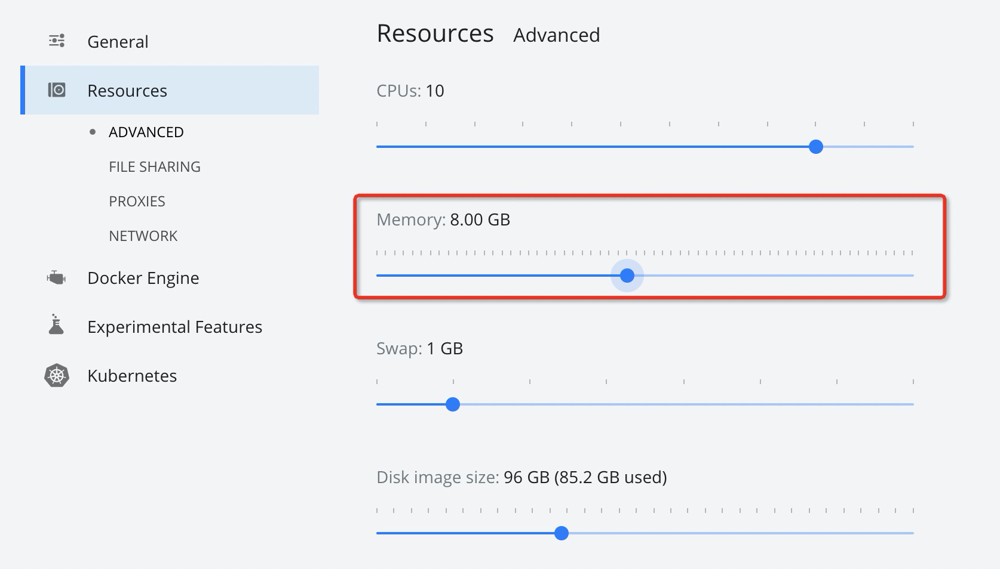
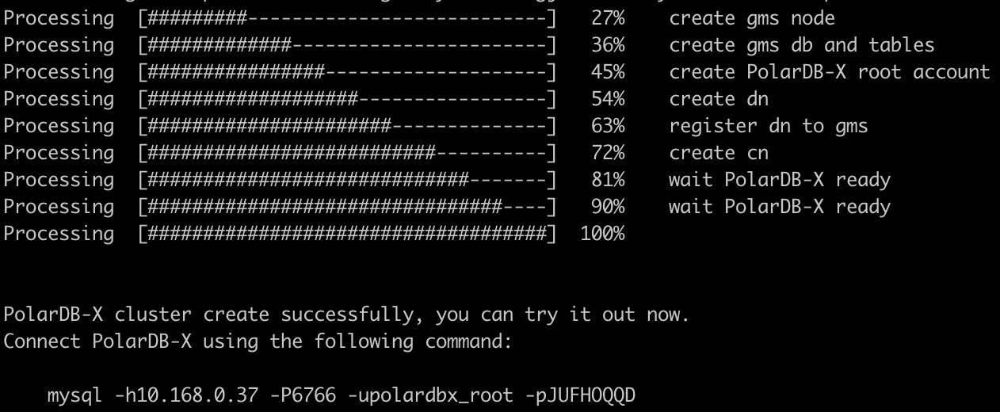

# Quick Start

To get started with PolarDB-X, you will use the PXD tool. 
With PXD installed, you can run a PolarDB-X with just one-click.
> Notes:
> - PXD is mainly used for test or development, for production environment please use [GalaxyKube](https://github.com/ApsaraDB/galaxykube) to deploy PolarDB-X on K8S.

## Prerequisites
Deploying PolarDB-X via PXD tool requires Python3 and Docker to be installed first. 
Here is how they are installed for different operating systems:
> PXD is only supported on x86 currently
*  [macOS](#macos-env)
*  [CentOS](#centos-env)
*  [Ubuntu](#ubuntu-env)
*  [Windows](#windows-env)

### <a name="macos-env">macOS</a>

> MacBook with M1 processor is currently not supported.

1.Install Python3
> If you already have python3 installed, you can skip to step 2
> 
> Check whether python3 is installed by `which python3`
> 
> It is recommended to use Homebrew to install python3, you can refer to the official Homebrew installation shell command: 
```shell
/bin/bash -c "$(curl -fsSL https://raw.githubusercontent.com/Homebrew/install/master/install.sh)"
```
Install python3 by brew
```shell
brew install python
```

2.Install Docker Desktop for Mac
> See the official guide: [https://docs.docker.com/desktop/mac/install/](https://docs.docker.com/desktop/mac/install/)
> 
> After installation, adjust the memory to 8G:



### <a name="centos-env">CentOS</a>

1.Install Python3
> If you already have python3 installed, you can skip to step 2
> 
> Check whether python3 is installed by `which python3`

Install python3 by `yum`
```shell
yum update -y
yum install -y python3
```

2.Install Docker
> See the official guide: [https://docs.docker.com/engine/install/centos/](https://docs.docker.com/engine/install/centos/)
> 
> Check whether you have the right permission by `docker ps` after the installation.
> 
> If you encounter the following error, see [Docker Permission](#docker-root-permission) for a fix.
```text
Got permission denied while trying to connect to the Docker daemon socket at unix:///var/run/docker.sock: Get http:///var/run/docker.sock/v1.26/images/json: dial unix /var/run/docker.sock: connect: permission denied
```

### <a name="ubuntu-env">Ubuntu</a>

1.Install Python3
> If you already have python3 installed, you can skip to step 2
>
> Check whether python3 is installed by `which python3`

Install python3 by `apt-get`
```shell
apt-get update
apt-get install python3.8 python3.8-venv
```

2.Install Docker
> See the official guide: [https://docs.docker.com/engine/install/](https://docs.docker.com/engine/install/)
> 
> Check whether you have the right permission by `docker ps` after the installation.
>
> If you encounter the following error, see [Docker Permission](#docker-root-permission) for a fix.
```text
Got permission denied while trying to connect to the Docker daemon socket at unix:///var/run/docker.sock: Get http:///var/run/docker.sock/v1.26/images/json: dial unix /var/run/docker.sock: connect: permission denied
```

### <a name="windows-env">Windows</a>

WSL is generally used to run PolarDB-X on Windows platforms.

1.Install WSL
> See the official guide: [https://docs.microsoft.com/en-us/windows/wsl/install](https://docs.microsoft.com/en-us/windows/wsl/install).
> 
> Use the default Linux distribution, Ubuntu

2.Install Docker Desktop 
> See the official guide: [https://docs.docker.com/desktop/windows/wsl/](https://docs.docker.com/desktop/windows/wsl/)

3.Install Python3
> Skip this step if you already have python3 installed 

```shell
apt-get install python3
apt-get install python3-venv
```

4.Install pip

```shell
apt-get install python3-pip
```

## Install PXD

> NOTE: It is Recommended to use Python Virtual Environment to install PXD tool
```shell
python3 -m venv venv
source venv/bin/activate
```

Upgrade the PIP before installation
```shell
pip install --upgrade pip
```

Install PXD 
```shell
pip install pxd
```

> Note: Mainland China users downloading packages from pypi is slow, you can download it from the AliCloud.
```shell
pip install -i https://mirrors.aliyun.com/pypi/simple/ pxd
```

## Install PolarDB-X

- Running the pxd tryout command to create an up-to-date version of the PolarDB-X database (with 1 node each of GMS, CN, DN, CDC).
```shell
pxd tryout
```

- You can also specify the number of CN, DN, CDC nodes and the version with the following command.
```shell
pxd tryout -cn_replica 1 -cn_version latest -dn_replica 1 -dn_version latest -cdc_replica 1 -cdc_version latest
```
After the PolarDB-X database is created, the connection information will be printed:

> Note: The password of PolarDB-X administrator is generated randomly, and it only appears once.

You can connect to PolarDB-X through MySQL client now.

Try the following SQLs to enjoy the features of PolarDB-X. More details see: [PolarDB-X SQL Manual](https://www.alibabacloud.com/help/doc-detail/71252.htm).

```sql
# Check GMS 
select * from information_schema.schemata;

# Check create database
create database polarx_example mode=auto;

use polarx_example;

create table example (
  `id` bigint(11) auto_increment NOT NULL,
  `name` varchar(255) DEFAULT NULL,
  `score` bigint(11) DEFAULT NULL,
  primary key (`id`)
) engine=InnoDB default charset=utf8 
partition by hash(id) 
partitions 8;

insert into example values(null,'lily',375),(null,'lisa',400),(null,'ljh',500);

select * from example;

show topology from example;

# Check CDC
show master status ;
show binlog events in 'binlog.000001' from 4;


# Check CN and DN
show storage ;  
show mpp ;  
```

## Check the Status of PolarDB-X
Show a list of PolarDB-X in the current environment:
```shell
pxd list
```

## Cleanup PolarDB-X
Cleanup all PolarDB-X instances by:
```shell
pxd cleanup
```

## FAQ

### <a name="docker-root-permission">Docker Permission</a>

1.Create a `docker` group

```shell
sudo groupadd docker
```

2.Add User to the `docker` Group

```shell
sudo gpasswd -a ${USER} docker
```

3.Switch the Current Group to the `docker` Group

```shell
newgrp docker
```
> NOTE: you can also log out and log back in

4.Check the permission by `docker ps`


### PolarDB-X Port Usage
During the creation of PolarDB-X, 
the CN, DN and GMS nodes will each occupy a randomly generated port. 
If PolarDB-X fails to be created due to port conflict, 
please execute ` pxd cleanup` or `pxd delete {cluster name}` to clean it up and recreate it.
