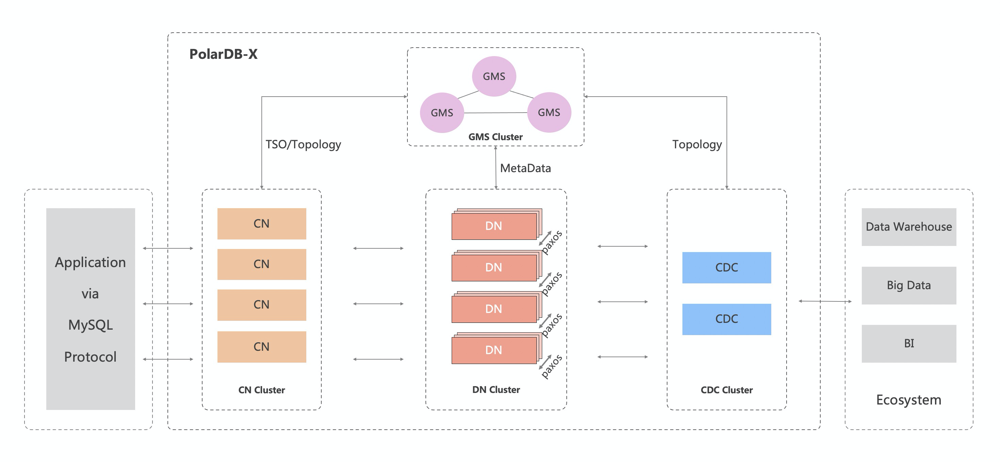

[English Version](../../README.md)

## 什么是 PolarDB-X ？
PolarDB-X 是一款面向超高并发、海量存储、复杂查询场景设计的云原生分布式数据库系统。其采用 Shared-nothing 与存储计算分离架构，支持水平扩展、分布式事务、混合负载等能力，具备企业级、云原生、高可用、高度兼容 MySQL 系统及生态等特点。

PolarDB-X 最初为解决阿里巴巴天猫“双十一”核心交易系统数据库扩展性瓶颈而生，之后伴随阿里云一路成长，是一款经过多种核心业务场景验证的、成熟稳定的数据库系统。
PolarDB-X 的核心特性如下：

- 水平扩展

PolarDB-X 采用 Shared-nothing 架构进行设计，支持多种 Hash 和 Range 数据拆分算法，通过隐式主键拆分和数据分片动态调度，实现系统的透明水平扩展。

- 分布式事务

PolarDB-X 采用 MVCC + TSO 方案及 2PC 协议实现分布式事务。事务满足 ACID 特性，支持 RC/RR 隔离级别，并通过一阶段提交、只读事务、异步提交等优化实现事务的高性能。

- 混合负载

PolarDB-X 通过原生 MPP 能力实现对分析型查询的支持，通过 CPU quota 约束、内存池化、存储资源分离等实现了 OLTP 与 OLAP 流量的强隔离。

- 企业级

PolarDB-X 为企业场景设计了诸多内核能力，例如 SQL 限流、SQL Advisor、TDE、三权分立、Flashback Query 等。

- 云原生

PolarDB-X 在阿里云上有多年的云原生实践，支持通过 K8S Operator 管理集群资源，支持公有云、混合云、专有云等多种形态进行部署，并支持国产化操作系统和芯片。

- 高可用

通过多数派 Paxos 协议实现数据强一致，支持两地三中心、三地五副本等多种容灾方式，同时通过 Table Group、Geo-locality 等提高系统可用性。

- 兼容 MySQL 系统及生态

PolarDB-X 的目标是完全兼容 MySQL ，目前兼容的内容包括 MySQL 协议、MySQL 大部分语法、Collation、事务隔离级别、Binlog 等。

## 快速入门
PolarDB-X 根据场景提供三种不同的部署方式。

1. 快速体验模式

PolarDB-X 支持通过 PXD 工具在本地一键创建实例，通过该方式可快速体验 PolarDB-X 的相关功能。
PXD 使用说明参考[这里](quickstart.md)。

2. K8S 部署模式

PolarDB-X 提供 K8S 部署模式，通过该方式，可对 PolarDB-X 集群做更多定制化配置。K8S 部署教程参考[这里](https://github.com/ApsaraDB/galaxykube#quick-start) 。

3. 源码编译安装模式

如果想从源码编译安装 PolarDB-X，可参考[这里](quickstart-development.md)。

更多文档可参考[这里](https://polardbx.com) 。
如果对 PolarDB-X 的设计细节感兴趣，可关注我们的[知乎专栏](https://www.zhihu.com/org/polardb-x) 。

## 架构

PolarDB-X 采用 Shared-nothing 与存储分离计算架构进行设计，系统由4个核心组件组成。

- 计算节点（CN, Compute Node）

计算节点是系统的入口，采用无状态设计，包括 SQL 解析器、优化器、执行器等模块。负责数据分布式路由、计算及动态调度，负责分布式事务 2PC 协调、全局二级索引维护等，同时提供 SQL 限流、三权分立等企业级特性。

- 存储节点（DN, Data Node）

存储节点负责数据的持久化，基于多数派 Paxos 协议提供数据高可靠、强一致保障，同时通过 MVCC 维护分布式事务可见性。

- 元数据服务（GMS, Global Meta Service）

元数据服务负责维护全局强一致的 Table/Schema, Statistics 等系统 Meta 信息，维护账号、权限等安全信息，同时提供全局授时服务（即 TSO）。

- 日志节点（CDC, Change Data Capture）

日志节点提供完全兼容 MySQL Binlog 格式和协议的增量订阅能力，提供兼容 MySQL Replication 协议的主从复制能力。

PolarDB-X 提供通过 K8S Operator 方式管理以上4个组件，同时计算节点与存储节点之间可通过私有协议进行 RPC 通信，这些组件对应的仓库如下。

| 组件名称 | 仓库地址 | 版本号             |
| --- | --- |-----------------|
| 计算节点（CN, Compute Node） | [galaxysql](https://github.com/ApsaraDB/galaxysql) | v5.4.13-16615127 |
| 元数据服务（GMS, Global Meta Service） | [galaxyengine](https://github.com/ApsaraDB/galaxyengine) | v1.0.2 |
| 存储节点（DN, Data Node） | [galaxyengine](https://github.com/ApsaraDB/galaxyengine) | v1.0.2 |
| 日志节点（CDC, Change Data Capture） | [galaxycdc](https://github.com/ApsaraDB/galaxycdc) | v5.4.13 |
| 私有协议 | [galaxyglue](https://github.com/ApsaraDB/galaxyglue) |  v5.4.13-16615127 |
| K8S Operator | [galaxykube](https://github.com/ApsaraDB/galaxykube) | v1.2.2 |

## 什么是 ApsaraDB GalaxySQL ？
GalaxySQL 是 PolarDB-X 的计算节点（CN, Compute Node）。

## License
ApsaraDB GalaxySQL 采用 Apache License 2.0 协议。协议详情参看 [License](../../LICENSE) 文件。

## 贡献
欢迎大家为 PolarDB-X 作出贡献，我们感谢包括使用体验、反馈问题、提交 PR 等在内的任何形式的贡献。关于如何开始开发和提交 PR，请参考[这里](../../CONTRIBUTING.md)。 

## 社区
欢迎大家加入社区讨论 PolarDB-X 相关问题:
- 钉钉群: [32432897](https://h5.dingtalk.com/circle/healthCheckin.html?dtaction=os&corpId=dingc5456617ca6ab502e1cc01e222598659&1b3d4=1ec1b&cbdbhh=qwertyuiop#/)  
  
- 微信群: 阿里云 PolarDB-X 开源交流群（人数已达限制，联系管理员 oldbread3, hustfxj, agapple0002 加入）  
     

## 致谢
ApsaraDB GalaxySQL 中引用或借鉴了很多开源社区的代码，例如 Calcite、Presto 等，真诚感谢这些项目和贡献人员。
## 

