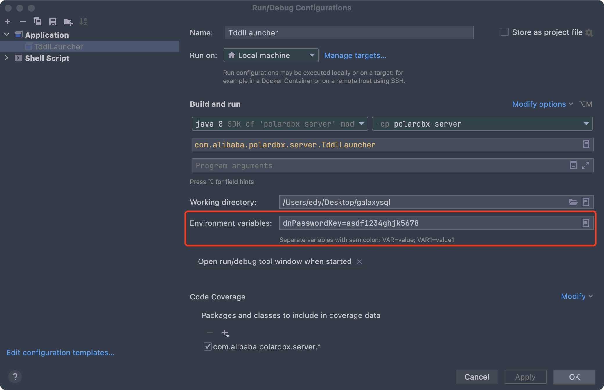
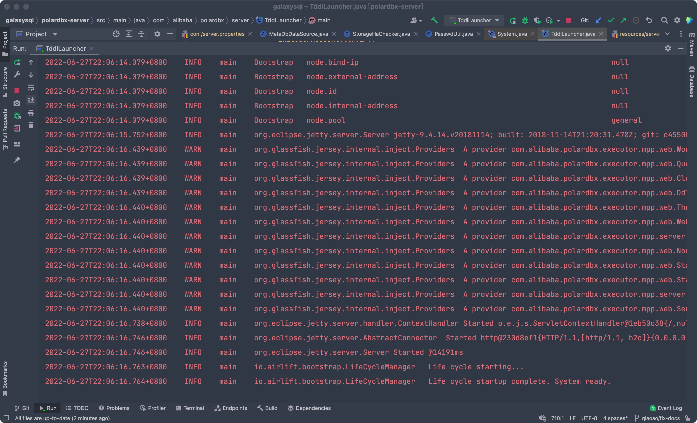
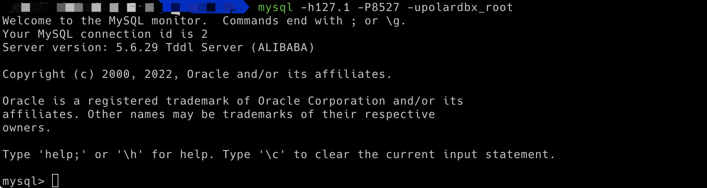

### 概述

作为一个开源社区贡献者，通常使用MacOS等操作系统进行开发，如何在本地搭建PolarDB-X的开发环境呢？

本文档对PolarDB-X的本地CN端开发流程进行了说明，覆盖代码编译、数据库安装、部署等流程。

备注：本文档主要针对只进行CN端开发人员使用，采用MacOS + Idea的组合，方便开源社区参与者能够在本地部署可运行的PolarDB-X环境并对CN端进行debug。

### 源码下载

下载 [PolarDB-X SQL](https://github.com/polardb/polardbx-sql) 代码，main 分支

``` shell
git clone https://github.com/polardb/polardbx-sql
```

### 安装依赖

进入CN代码目录下载相应的依赖，注意系统及maven均使用JDK 17

```shell
# 安装依赖 JDK 17 和 Maven 3

# 进入代码目录 
cd polardbx-sql/

# 确保 polardbx-rpc 子模块 (PolarDB-X Glue) 已初始化
git submodule update --init

# 编译打包
mvn install -D maven.test.skip=true -D env=release 
```

### 安装DN docker镜像

首先在本地安装docker

```shell
# 使用homebrew下载docker
brew install --cask --appdir=/Applications docker
```

也可以下载docker桌面版：[Install Docker Desktop on Mac](https://docs.docker.com/desktop/mac/install/)

```shell
# 运行PolarDB-X远程镜像并建立端口映射
# 默认使用 4886 作为 mysql端口，32886 作为私有协议端口
docker run -d --name some-dn-and-gms --env mode=dev -p 4886:4886 -p 32886:32886 polardbx/polardb-x
```

使用``` docker ps -a ```指令查看当前运行的容器以及相应的端口映射。

### 修改resources/server.properties

查看PolarDB-X的`metaDbPasswd`

```shell
mysql -h127.0.0.1 -P4886 -uroot -padmin -D polardbx_meta_db_polardbx -e "select passwd_enc from storage_info where inst_kind=2"
```

进入`polardbx-server/src/main/resources/server.properties`文件并依次修改以下变量

```shell
# PolarDB-X 服务端口
serverPort=8527
managerPort=3406
# PolarDB-X RPC 端口
rpcPort=9090
charset=utf-8
processors=4
processorHandler=16
processorKillExecutor=128
timerExecutor=8
managerExecutor=256
serverExecutor=1024
idleTimeout=
trustedIps=127.0.0.1
slowSqlTime=1000
maxConnection=20000
allowManagerLogin=1
allowCrossDbQuery=true
galaxyXProtocol=1
# MetaDB地址
metaDbAddr=127.0.0.1:4886
# MetaDB私有协议端口
metaDbXprotoPort=32886
# MetaDB用户
metaDbUser=my_polarx
metaDbName=polardbx_meta_db_polardbx
# PolarDB-X实例名
instanceId=polardbx-polardbx
#metaDb密码，通过查询获得
metaDbPasswd=+row16HHcsxn1JZ4YKcsrzjxOg1WZcRLUgba/IRagfc=
```

### 修改Idea环境变量

在使用Idea作为调试IDE时，首先需要保证工程JDK使用JDK 17。

添加Idea的环境变量`dnPasswordKey`，默认使用asdf1234ghjk5678

将Idea中`Preference - Build,Execution,Deployment - Build tools - maven - importing - VM options for importer`设置为`-Xmx2048m -Xms2048m`

将Idea中`Preference-Compiler-Build process heap size`设置为4096



### 运行TddlLauncher.java

CN代码的运行入口为`com/alibaba/polardbx/server/TddlLauncher.java`，运行`TddlLauncher.java`即可看到相应日志输出。



连接PolarDB-X验证，如果能连上，说明数据库启动成功。

``` shell
mysql -h127.1 -P8527 -upolardbx_root
```



FYI: 系统运行日志在 polardbx-sql 同级目录的 logs 文件夹中。