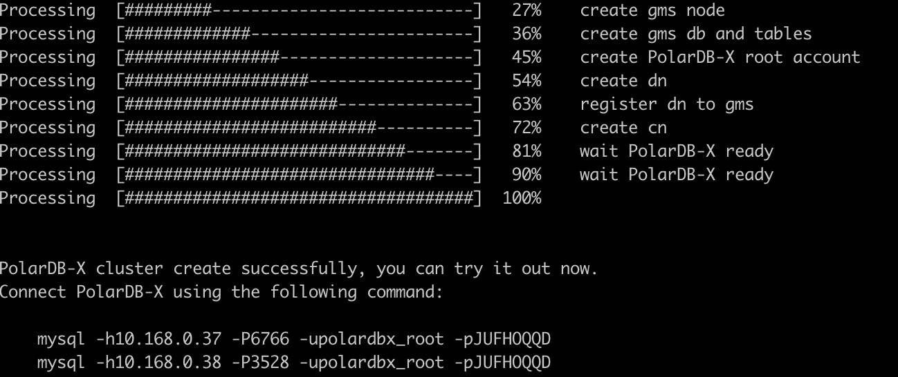
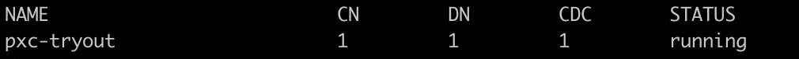

# 使用 PXD 在集群部署 PolarDB-X

PXD 是 PolarDB-X 的部署工具，除了支持在本地一键快速拉起测试环境外，也支持在 Linux 集群中通过指定的拓扑的方式部署 PolarDB-X 分布式数据库。

## 1. 软硬件环境检查
检查机器的硬件及软件配置，详见：

* [软硬件需求](https://yuque.antfin.com/coronadb/doc/yp2qzf)


## 2. 系统配置

1. 在集群内的所有机器上安装 Docker，参考文档：[https://docs.docker.com/engine/install/](https://docs.docker.com/engine/install/)
> 注：集群模式下，docker engine 版本需要大于等于18.04。
> 安装完成后执行 `docker ps` 命令验证。如果遇到如下报错，请参考：[非root用户如何获取docker权限](quickstart.md#非root用户如何获取docker权限)
Got permission denied while trying to connect to the Docker daemon socket at unix:///var/run/docker.sock: Get http:///var/run/docker.sock/v1.26/images/json: dial unix /var/run/docker.sock: connect: permission denied

2. 集群机器建配置免密登录。
> 如果你的集群机器上已经配置过SSH免密登录，可以跳过

```
# 生成密钥对
ssh-keygen -t rsa

# 复制免登公钥到目标机器，修改user和ip
ssh-copy-id {user}@{ip}
```
## 3. 在部署机上安装 PXD
选择任意一台机器作为部署机，在这台机器上安装 PXD 即可。PXD 会通过部署机在集群内创建 PolarDB-X 数据库。

### 准备工作

1.安装 Python3

> 如果你的机器上已经安装了 python3，可以跳过 
> 检查命令：which python3，如果有返回则代表python3已安装

Red Hat, CentOS or Fedora:

```shell
yum update -y
yum install -y python3
```
Debian or Ubuntu:

```plsql
apt-get update
apt-get install python3.7
```

2.创建一个 Python3 的 virtual environment 环境并激活

```shell
python3 -m venv venv
source venv/bin/activate
```
> 推荐使用 virtual environment 安装 PXD 工具


### 安装 PXD
安装前建议先执行如下命令升级pip

```shell
pip install --upgrade pip
```
执行如下命令安装 pxd: 

```shell
pip install pxd
```
> 注： 部分国内用户从 pypi 下载包的速度较慢, 可以使用如下命令从阿里云的镜像安装：
> pip install -i http://mirrors.aliyun.com/pypi/simple/ pxd

## 4. 准备 PolarDB-X 拓扑文件
编写如下的 YAML 文件，指定 PolarDB-X 集群的名称以及 GMS， CN，DN 的部署节点。

比如：总共准备了3台机器10.168.0.37、10.168.0.38、10.168.0.39
1. 10.168.0.37，部署gms、cdc节点
2. 10.168.0.38、10.168.0.39，部署cn/dn各两个节点。其中dn下的 host_group 表示一个dn节点多副本的部署机器，比如Paxos三副本的话需要填入三个ip。目前仅支持单副本模式，host_group 中填1个ip即可

```yaml
version: v1
type: polardbx
cluster:
  name: pxc_test
  gms:
    image: polardbx/galaxyengine:latest
    host_group: [10.168.0.37]
  cn:
    image: polardbx/galaxysql:latest
    replica: 2
    nodes:
      - host: 10.168.0.38
      - host: 10.168.0.39
    resources:
      mem_limit: 4G
  dn:
    image: polardbx/galaxyengine:latest
    replica: 2
    nodes:
      - host_group: [10.168.0.38]
      - host_group: [10.168.0.39]
    resources:
      mem_limit: 4G
  cdc:
    image: polardbx/galaxycdc:latest
    replica: 1
    nodes:
      - host: 10.168.0.37
    resources:
      mem_limit: 4G
```

通过以上拓扑文件创建的 PolarDB-X 集群。拓扑文件包括如下属性:

- version: 拓扑文件版本，无需修改
- type: polardbx， 无需修改
- cluster.name：PolarDB-X 集群名称
- cluster.gms.image: gms docker 镜像名称，可不填。默认为最新镜像
- cluster.gms.host_group: gms 机器 ip 列表，目前仅支持1台机器单副本模式，列表中填写1个ip即可
- cluster.cn
   - image: 计算节点镜像名称，可不填，默认为最新镜像
   - replica: 计算节点数目，需要与nodes中的host数量对应
   - nodes: 计算节点的ip列表
   - resources: 计算节点使用的资源
      - mem_limit: 内存上限，默认 2G
- cluster.dn
   - image: 数据节点镜像名称，可不填，默认为最新镜像
   - replica: 数据节点数目，需要与nodes中的 host_group 数量对应
   - nodes: 存储节点的host_group列表，一个 host_group 表示一个dn节点多副本的部署机器，比如Paxos三副本的话需要填入三个ip。目前仅支持单副本模式，host_group 中填1个ip即可
   - resources: 存储节点使用的资源
      - mem_limit: 内存上限，默认 2G
- cluster.cdc
   - image: CDC 节点镜像名称，可不填，默认为最新镜像
   - replica: CDC 节点数目，需要与nodes中的host数量对应
   - nodes: CDC 节点的ip列表
   - resources: CDC 节点使用的资源
      - mem_limit: 内存上限，默认 2G

## 5. 创建 PolarDB-X 集群
执行如下命令，即可在集群内一键部署 PolarDB-X：

```shell
pxd create -file polardbx.yaml
```
部署完成后，pxd 会输出 PolarDB-X 集群的连接方式，通过 MySQL 命令行即可登录 PolarDB-X 数据库进行测试。

> 注：
> - PolarDB-X 管理员账号的密码是随机生成的，仅出现这一次，请注意保存。
> - PolarDB-X CN 本身是无状态的，集群环境下会部署多个CN 节点，任意的 CN 都可登陆执行 SQL。如需要负载均衡，可以通过负载均衡组件（如 LVS、HAProxy 或 F5 等）对外提供统一的接入地址。


通过 MySQL client 即可连接，执行如下 SQL 初步体验 PolarDB-X 的分布式特性。PolarDB-X SQL 详情请参考：[SQL 概述](https://help.aliyun.com/document_detail/313263.html)

```sql
# 检查GMS 
select * from information_schema.schemata;

# 创建分区表
create database polarx_example partition_mode='partitioning';

use polarx_example;

create table example (
  `id` bigint(11) auto_increment NOT NULL,
  `name` varchar(255) DEFAULT NULL,
  `score` bigint(11) DEFAULT NULL,
  primary key (`id`)
) engine=InnoDB default charset=utf8 
partition by hash(id) 
partitions 8;

insert into example values(null,'lily',375),(null,'lisa',400),(null,'ljh',500);

select * from example;

show topology from example;

# 检查CDC
show master status ;
show binlog events in 'binlog.000001' from 4;


# 检查DN和CN
show storage ;  
show mpp ;    
```

## 6. 查看 PolarDB-X 集群状态
执行如下命令查看 PolarDB-X 集群状态：

```shell
pxd list
```


执行如下命令可以查看 pxd 的更多指令及用法：
```plsql
pxd --help
```
